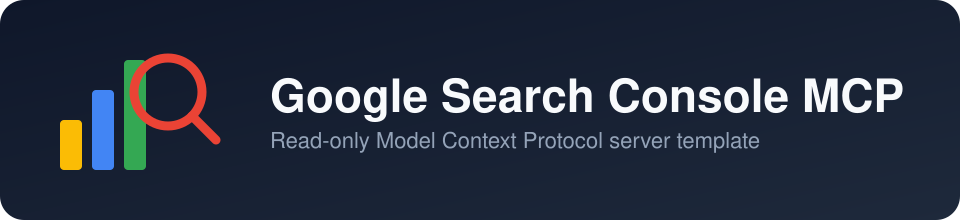
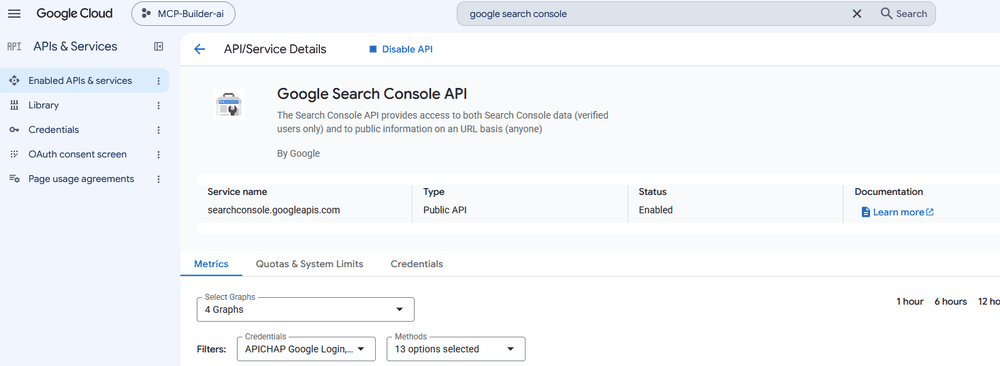
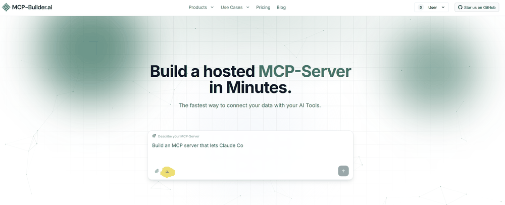
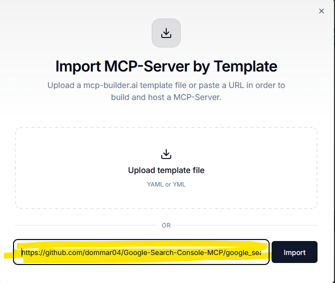
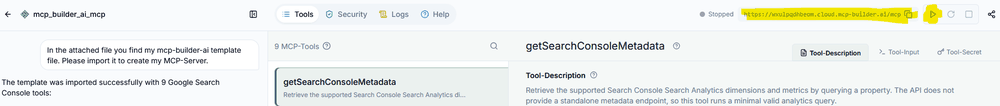

<p align="center">
  
</p>

<p align="center">
  <a href="./LICENSE"></a>
  
  
  
  <a href="https://mcp-builder.ai"></a>
  
  
  
</p>

# Google Search Console MCP Server

A free, read-only [MCP](https://modelcontextprotocol.io) server template for Google Search Console. Connect an AI agent (Claude, ChatGPT, or any MCP-compatible client) directly to your Search Console data to query performance reports, inspect indexing status, find SEO opportunities, and more — all in natural language.

> **Fully hosted, private, HTTP-Streamable MCP server — no tech setup needed.** Import the template on mcp-builder.ai and get a ready-to-use server URL in minutes.

This is a [mcp-builder.ai](https://mcp-builder.ai) template: import it, hit start, and you get a private, fully hosted MCP server with Google OAuth 2.0 built in. No servers to run, no code to write.

## Features

This server is **read-only** — it can query and report on your Search Console data, but it cannot change any settings or submit/delete anything.

| Tool | Description |
|---|---|
| `listSearchConsoleSites` | List Search Console properties the account can access. |
| `getSearchConsoleSettings` | Retrieve settings for a property, including geographic target and preferred domain. |
| `getSearchConsoleMetadata` | Retrieve the supported Search Analytics dimensions and metrics. |
| `querySearchAnalytics` | Query performance data by date, query, page, country, device, or search appearance. |
| `getSearchPerformanceReport` | Generate a performance report grouped by selected dimensions. |
| `getSeoOpportunities` | Find opportunities such as high-impression/low-CTR queries and queries ranking between positions 4–20. |
| `inspectUrlIndexing` | Check whether a URL is indexed and review its inspection result. |
| `listSitemaps` | List sitemaps submitted for a property, optionally filtered by sitemap index. |
| `getSitemapDetails` | Get submission and processing details for one sitemap. |

## How it works

The template is defined in [`google_search_console_mcp_server.yaml`](./google_search_console_mcp_server.yaml) and deployed through mcp-builder.ai, which hosts the server for you and handles the OAuth 2.0 flow with Google on your behalf.

## Getting started

### 1. Create a Google OAuth client

1. In the [Google Cloud Console](https://console.cloud.google.com/apis/library/searchconsole.googleapis.com), enable the **Search Console API** for your project.

<p align="center">
  
</p>

2. In the [Credentials page](https://console.cloud.google.com/apis/credentials), create an OAuth 2.0 Client ID. You'll need the **Client ID** and **Client Secret**.

<p align="center">
  
</p>

### 2. Deploy the template on mcp-builder.ai

1. Create an account at [mcp-builder.ai](https://mcp-builder.ai) and start a new MCP server.

<p align="center">
  
</p>

2. Import this template using the URL to the template's YAML file on GitHub:
   ```
   https://github.com/dommar04/Google-Search-Console-MCP/blob/main/google_search_console_mcp_server.yaml
   ```

<p align="center">
  
</p>

3. Once the project is created, hit **Start** and copy the generated server URL — you'll add this to your MCP client.

<p align="center">
  
</p>

### 3. Connect your MCP client

In your MCP client (e.g. Claude), add a new remote MCP server:

- **URL**: the server URL from mcp-builder.ai
- **Auth type**: OAuth 2.0
- **Client ID / Client Secret**: from step 1
- **Scopes**:
  - `openid`
  - `https://www.googleapis.com/auth/webmasters.readonly`

Authorize the connection, and your agent can now query your Search Console data.

## License

Released under the [MIT License](./LICENSE) — free to use, modify, and distribute.

## Disclaimer

I am one of the developers behind [mcp-builder.ai](https://mcp-builder.ai) therefore super happy for any feedback about the platform :)
